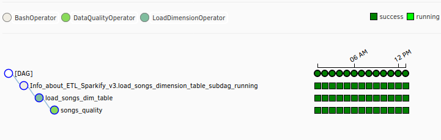

##### Udacity Data Engineering Nanodegree

  
</br>
</br>
</br>

# Project  : Data Pipelines

About an ETL pipeline for a data lake hosted on S3.

### Table of contents

   - [About The Project](#about-the-project)
   - [Purpose](#purpose)
   - [Getting Started](#getting-started)
        - [Dataset](#dataset)
   - [Setup](#Setup)
        - [Docker](#Docker)
        - [Python scripts to setup AWS](#Python-scripts-to-setup-AWS)
        - [Makefile](#Makefile)
        - [Last word](#Last-word)

   - [Worflow](#worflow)
        - [Define a Star Schema](#Define-a-Star-Schema)
        - [Sparkify Analytical](#Sparkify-Analytical)
   - [Web-links](#web-links)


## About The Project
> A music streaming company, Sparkify, has decided that it is time to introduce more automation and monitoring to their data warehouse ETL pipelines and come to the conclusion that the best tool to achieve this is Apache Airflow.  

## Purpose

This traffic activity generates a large number of different events that need to be collected, transformed, reconciled, analyzed and understood in order to fully understand customer needs and improve Sparkify's services. Several tools such as Amazon S3 or Redshift allow to solve most dimensioning problems.   
Airflow allows to define, plan, execute, control and manage workflows in pure Python code, while providing the tools and user interface to manage these workflow operations.
The data pipeline should be:
* dynamic
* build from reusable tasks
* can be monitored
* allow backfills
* run tests after the ETL steps have been executed. 

## Getting Started

### Dataset


The twice datasetset reside in S3:  

* `Song data: s3://udacity-dend/song_data`
* `Log data: s3://udacity-dend/log_data`

##### Song Dataset

The first dataset is a subset of real data from the Million Song Dataset. Each file is in JSON format and contains metadata about a song and the artist of that song. The files are partitioned by the first three letters of each song's track ID. 
```
song_data/A/B/C/TRABCEI128F424C983.json
song_data/A/A/B/TRAABJL12903CDCF1A.json
```
And below is an example of what a single song file, TRAABJL12903CDCF1A.json, looks like.
```
{"num_songs": 1, "artist_id": "ARJIE2Y1187B994AB7", "artist_latitude": null, "artist_longitude": null, "artist_location": "", "artist_name": "Line Renaud", "song_id": "SOUPIRU12A6D4FA1E1", "title": "Der Kleine Dompfaff", "duration": 152.92036, "year": 0}
```
##### Log Dataset

The second dataset consists of log files in JSON format generated by this event simulator based on the songs in the dataset above. These simulate app activity logs from an imaginary music streaming app based on configuration settings.
The log files in the dataset you'll be working with are partitioned by year and month. 
```
log_data/2018/11/2018-11-12-events.json
log_data/2018/11/2018-11-13-events.json
```
And below is an example of what the data in a log file, 2018-11-12-events.json, looks like.  


### Bypass Setup
If you don't need Docke setup, Redshift scripts and Makefile, go to [Last word](#Last-word) to setup Connections in the Airflow web UI.

## Setup

To setup, I first needed to create infrastructure to run Airflow and Aws. It's looked like this:
* Docker to build containers Postgres and Airflow
* Python scripts to launch and stop Aws Redshift and access to Aws s3 in an conda environment 'psyco'.
* A Makefile to allow a couple of commands and everything is set.
* First git clone [this project](https://github.com/anthelix/udacity_project5.git).

#### Docker
* Assume to have Docker installed, I use _puckel/docker-airfloow_ from Docker Hub. 
* Build 2 containers, Airflow and Postgres to airflow metadata
* You can visit the Docker Folder to check the config
* run : `systemctl start docker` 

#### Python scripts to setup AWS
*  I create a Conda Environment `psyco`
    ```sql
    conda create --quiet --yes --name psyco psycopg2 boto3 configparser numpy pandas tabulate botocore
    conda install --yes -c conda-forge ipython-sql    
    ```
* To uses it:
    ```python
    conda activate psyco # run
    conda deactivate # close
    conda remove --name psyco --all # remove
    conda info --envs # check psyco setup
    ```
Then, setup the `./redshift/dwh.cfg` file with your AWS credentials. The `mycluster.py` python script, create a roleArn, a Redshift Cluster and a connection with the Vpc default Group. 

#### Makefile
For now, we have "psyco" Conda environment and Docker container setup. This Makefile allows me to use commands in a simple way and often.
* Run `make` to get the help for this Makefile
* In the root folder of this project, location of the Makefile file, 
    * `conda activate psyco`
    * `make redshift`
    * `make config`, 
    * setup the `./airflow-secret.yaml` with your credentials. It's a temporary file which will be deleted with the `make run` command just after it has been copied to the new container. 
    * `make run`
    * Once you do that, Airflow is running on your machine, and you can visit the UI by visiting http://localhost:8080/admin/

#### At the end
* `make clean` Down docker and remove files
* `make stop` Down Redshift

#### Workflow: useful cmd 
```sh
sudo systemctl # start Docker
docker images # list docker images
docker rmi -f $(docker images -qa) # delete images
docker stop $(docker ps -a -q)  # stop container running
docker rm $(docker ps -a -q) # delete container
docker-compose up -d # run docker 
docker-compose up -d --build # run docker and buil image
docker-compose logs # Displays log output
docker-compose ps # List containers
```
If you want to run airflow sub-commands, you can do so like this:
```sh
    docker-compose run --rm webserver airflow list_dags # List dags
    docker-compose run --rm webserver airflow test [DAG_ID] [TASK_ID] [EXECUTION_DATE] # Test specific task
```
If you want to run/test python script, you can do so like this:
```sh
    docker-compose run --rm webserver python /usr/local/airflow/dags/[PYTHON-FILE].py # Test python script
```
```sh
    docker exec -i -t $(shell docker ps -q --filter ancestor=puckel/docker-airflow) /bin/bash # run bash command in the container e.g make tty
    docker exec -i -t $(shell docker ps -q --filter ancestor=postgres:9.6) psql -U airflow # run psql command in the container and check metadatabase Airflow e.g make psql
```
#### Last word
* If you don't want to use the Docker setup nether the Redshift scripts, 
    * Install and setup Airflow
    * Launch a redshift cluster, get the ENDPOINT
    * Make sure you've configured connections: In Airflow web UI, Go to Admin -> Connections and Edit
        * AWS connection
        ```
            id: aws_credential
            type: aws
            login: <AWS_ACCESS_KEY_ID>
            password: <AWS_SECRET_ACCESS_KEY>
        ```
        * Redshift connection
        ```
            id: redshift
            type: postgres
            host: <CLUSTER ENDPOINT>
            schema: dev
            login: awsuser
            password: Passw0rd
            port: 5439
        ```
This creates hooks in Airflow that Dags can use. 

## Worflow
### Creating a Dag To Extract Files From S3, Transform and Load Tables To Redshift database

#### Main DAG
DAG :The top-level object is a Python object that defines the organization, structure and schedule of a workflow. Tasks in a specific workflow will be attached to it.

Dag run: run-time version of a DAG with additional context (state, beginnig, end, success)

```py
import datetime
from airflow import DAG
from airflow.operators.bash_operator import BashOperator
from airflow.operators.dummy_operator import DummyOperator
from airflow.operators.postgres_operator import PostgresOperator
from airflow.operators.subdag_operator import SubDagOperator
from airflow.operators.udacity_plugin import (StageToRedshiftOperator,
                                              LoadFactOperator,
                                              LoadDimensionOperator,
                                              DataQualityOperator,
                                              HasRowsOperator)
from helpers import CreateTables, SqlQueries
from subdag import get_s3_to_redshift_subdag, get_dimTables_to_Redshift_subdag

default_args = {
    'owner': 'Sparkify & Co',
    'depends_on_past': False,
    'catchup': False,
    'start_date': datetime.datetime(2018, 11, 1, 0, 0, 0, 0),
    'end_date' : datetime.datetime(2018, 11, 30, 0, 0, 0, 0),
    'email_on_retry': False,
    'retries': 3,
    'provide_context': True, 
    'retry_delay': datetime.timedelta(minutes=5),
    }
dag = DAG(
    'ETL_Sparkify_v3',
    default_args=default_args,
    description='ETL from S3 to Redshift with Airflow',
    schedule_interval='@hourly', # schedule_interval='0 * * * *'
    max_active_runs=1
)
```
This creates a DAG, planned to start every hour(the beginning of an hour) from 2018-11-1. If any of its task fails, it will be retried 3 times, at 5 minutes interval.
The Airflow UI gives us useful views to follow each task instance. 


#### Sub DAG skeleton

Task : It;s a step in the DAG, for a specific Operator. Tasks made the DAG worflow logic with dependencies.

Task instance : It's a run time specific execution task in the DAG. It's send by the scheduler to the worker in Airflow.

Dependencies : Organize tasks instance.

2 subdags performs basic hourly tasks on the database. 
The first one run sql statements from s3 to Redshift, copying data in stagings tables then check success.
* `get_s3_to_redshift_subdag()`
```py
def get_s3_to_redshift_subdag(
        parent_dag_name,
        task_id,
        redshift_conn_id,
        aws_credentials_id,
        create_tbl,
        target_table,
        s3_bucket,
        s3_key,
        custom,
        *args, **kwargs):

    dag= DAG(
        f"{parent_dag_name}.{task_id}",
        **kwargs
    )
    
    templated_command = """
    echo "**************** {{ task.owner }}, {{ task.task_id }}"
    echo "**************** The execution date : {{ ds }}"
    echo "**************** {{ task_instance_key_str }} is running"
    """

    info_task = BashOperator()

    copy_task = StageToRedshiftOperator()

    check_staging = HasRowsOperator()

    info_task >> copy_task 
    copy_task >> check_staging
    return dag
```

* `get_dimTables_to_Redshift_subdag()`

The second one, run sql statements to copy fron staging tables to dimension tables and check if null values in the primary key column. 

The sql code is provide in `./plugins/helpers/sql_queries.py`
```py
    user_table_insert = (""" SELECT distinct 
                    userid, 
                    firstname, 
                    lastname, 
                    gender, 
                    level
            FROM staging_events
            WHERE page='NextSong'
    """)
```

#### Operators
Operator : It's a Python class to make specific operation used in a DAG. Here, I use standard operators (PostgresOperator, BashOperator) and define customize operators (StageToRedshiftOperator, DataQualityOperator, HasRowOperators)

```py
class HasRowsOperator(BaseOperator):

    @apply_defaults
    def __init__(self,
                 redshift_conn_id="",
                 target_table="",
                 *args, **kwargs):

        super(HasRowsOperator, self).__init__(*args, **kwargs)
        self.target_table = target_table
        self.redshift_conn_id = redshift_conn_id

    def execute(self, context):
        self.log.info('********** HasRowsOperator is processing')
        redshift_hook = PostgresHook(self.redshift_conn_id)
        records = redshift_hook.get_records(f"SELECT COUNT(*) FROM {self.target_table}")
        self.log.info(f"********** Running for {self.target_table}")
        if len(records) < 1 or len(records[0]) < 1:
            raise ValueError(f"********** Data quality check failed. {self.target_table} returned no results")
        num_records = records[0][0]
        if num_records < 1:
            raise ValueError(f"********** Data quality check failed. {self.target_table} contained 0 rows")
        logging.info(f"********** Data quality on table {self.target_table} check passed with {records[0][0]} records")
        self.log.info(f"********** HasRowsOperator end !!")

```


## Web Links

* [Go Data Friven](https://godatadriven.com/blog/the-zen-of-python-and-apache-airflow/)

* [ETL best practices with Airflow](https://gtoonstra.github.io/etl-with-airflow/index.html)

* [Data Modeling](https://medium.com/@rchang/a-beginners-guide-to-data-engineering-part-ii-47c4e7cbda71)

* [Manage Data Pipelines](https://hackersandslackers.com/data-pipelines-apache-airflow/)

* [Macro Referencce](https://airflow.apache.org/docs/stable/macros-ref)